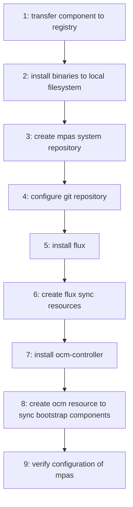

# Concept Paper: Subscriptions

Table of contents:
- [Context](#context)
- [Proposal](#proposal)
- [Appendix A: Glossary](#appendix-b-glossary)

## Context

User story: https://github.com/open-component-model/MPAS/issues/3

Setting up a new MPAS system requires an initial bootstrap phase and configuration. During this bootstrapping, all individual parts of the MPAS system need to be deployed on Kubernetes Infrastructure.

## Proposal

We will create a CLI tool that can install the necessary controllers, binaries and configurations to set up an MPAS system from scratch.

This tool should be capable of running idempotently in an air-gapped environment and should be based on OCM.

The following controllers will be installed:

- ocm-controller
- replication-controller
- git-controller
- mpas-project-controller
- mpas-product-controller
- flux source-controller
- flux kustomize-controller
- flux helm-controller
- flux notification-controller
- prometheus
- grafana

The following binaries will be installed:
- ocm
- flux

The system will be modelled using OCM in a component named `ocm.software/mpas/bootstrap`. The component archive will be written to a `tar.gz` file and delivered alongside the `mpas` CLI binary.

The binaries, for tools such as ocm and flux, will be installed to the local filesystem, the "bootstrap" OCM component will be transferred to a local registry and then the controllers will be deployed in a cluster specified by the user.

### Bootstrap Process

<details>
<summary><strong>Expand to view diagram</strong></summary>



</details>

To bootstrap an environment for MPAS using GitHub the following command can be issued:

```shell
mpas bootstrap github \
  --owner=test \
  --repository=mpas.control \
  --public-key=mpas.pub \
  --from-file=bootstrap-component-archive.tar.gz \ # this is the bootstrap component in archive format
  --registry=ghcr.io/phoban01/mpas \
  [--kubeconfig=~/.kubeconfig] \ # optional
  [--bin-dir=/usr/local/bin] # optional
```

First of all the component archive will be transferred to the specified registry. Then the binaries can be installed.

The Git Repository will be created if it doesn't exist and the following folder structure will be established:

```
projects/
subscriptions/
targets/
```

A README file containing instructions for adding projects, subscriptions or targets should also be added to the repository.

Flux should be installed into this repository under the path `./gitops` with appropriate `Kustomizations` targeting the `projects`, `subscriptions` and `targets` directories.

Next the ocm-controller should be installed.

Finally `ComponentVersion`, `Localization` and `FluxDeployer` manifests should be added to an `ocm-system` and configured to track the bootstrap component (note: the registry will need to be updated in the `ComponentVersion` custom resource). This will enable the `mpas` control plane to manage itself.

Once the bootstrap steps have been performed the CLI should run a verification to ensure that the mpas-system is configured correctly and ready for use.

### Adding MPAS resources

The `mpas` CLI should also make it easy to add projects, subscriptions or targets:

`mpas create project --name my-test-project`

`mpas create subscription --name my-subscription --registry ghcr.io/phoban01/ocm --component ocm.software/dummy:v1.0.0`

`mpas create target --name my-target`

`mpas create product-deployment-generator --name my-product`

These commands should output the YAML for the resource which can then be committed to the control plane repository.

### Miscellaneous

Kubernetes provides	the "k8s.io/cli-runtime/pkg/genericclioptions" package which can be used to add Kubernetes relevant config flags to the MPAS CLI.

## Appendix A: Glossary

#### Product

An MPAS Product is software that has been packaged using the Open Component Model. It contains both configuration resources, technical artifacts (such as Kubernetes manifests, docker images), localization & configuration rules and instructions that can be used by the MPAS to create a generate a product deployment pipeline.

#### Product Deployment

The `ProductDeployment` is a Kubernetes API object that specifies the information necessary to generate a product deployment pipeline. `ProductDeployment`'s are consumed by the Product controller.

#### Project

An MPAS Project is a collection of Products. Products are installed using OCM and GitOps. Products can be stored in one or more Git repositories that are managed by the Project.

The `Project` Kubernetes API object that contains the metadata required to create and manage an individual MPAS Project.

#### Subscription

A Subscription is request for an OCM component to be replicated from an delivery registry to a customer registry.

The `Subscription` Kubernetes API object specifies the details of the component, version constraints and the delivery & customer registries.

#### Project Subscription Binding

A Project Subscription Binding creates a relation between a Project and a component Subscription.

The `ProjectSubscriptionBinding` object contains a references to `Project` and `Subscription` objects. The Project controller watches `ProjectSubscriptionBinding` objects and creates `ProductDeployment` manifests.

#### Repository

A Repository is a Git repository that is created to house products installed as part of an MPAS project.

Because the Flux Source controller already defines an object named `GitRepository`, for the MPAS we shall define a Kubernetes API object named `Repository` that is describes project git repositories.

