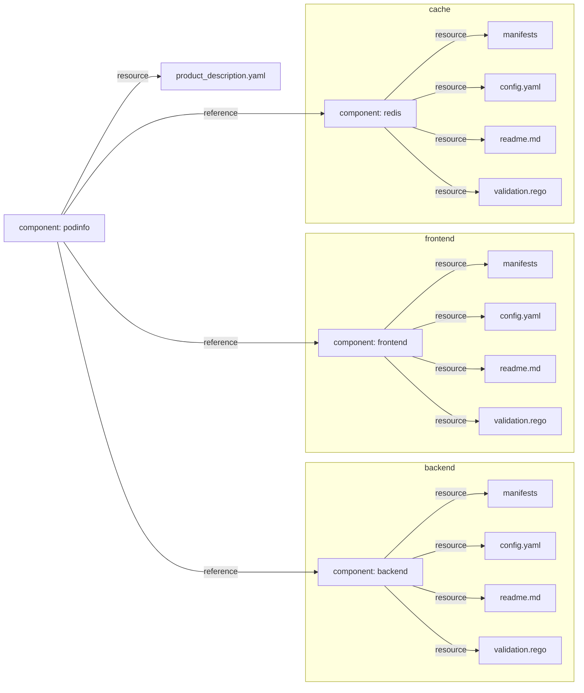

## Podinfo Product

### Structure

```mermaid
flowchart LR
    A -- resource --> E[product_description.yaml]

    A[component: podinfo] --->|reference| B[component: backend]
    A --->|reference| C[component: frontend]
    A --->|reference| D[component: redis]

    subgraph backend
    B -- resource --> B1[manifests]
    B -- resource --> B2[config.yaml]
    B -- resource --> B3[readme.md]
    B -- resource --> B4[validation.rego]
    end

    subgraph frontend
    C -- resource --> C1[manifests]
    C -- resource --> C2[config.yaml]
    C -- resource --> C3[readme.md]
    C -- resource --> C4[validation.rego]
    end

    subgraph cache
    D -- resource --> manifests
    D -- resource --> config.yaml
    D -- resource --> readme.md
    D -- resource--> validation.rego
    end
```
